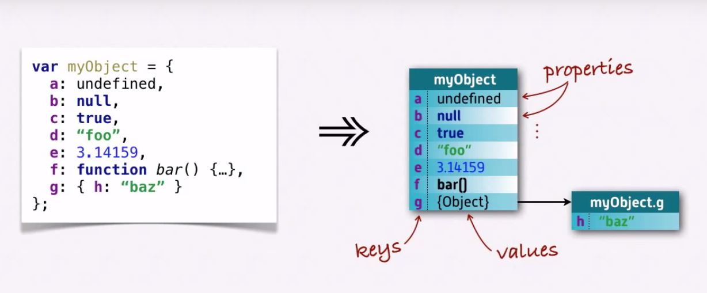

<h1>Definitive Guide to Object-Oriented Javascript Notes</h1>

Notes I compiled from the awesome almost 30-minute tutorial by <a href="http://www.letscodejavascript.com/">Let's Code Javascript by James Shore</a>

All images are screen shots of the video tutorial

    <a href="https://youtu.be/PMfcsYzj-9M">Video link to the tutorial</a>

<h2>1. Object Basics</h2>

    

    

    

    

    <blockquote>
        Primitives are passed by value:
    </blockquote>
    

    <blockquote>
        Objects are passed by reference:
    </blockquote>
    

    <blockquote>
        Difference between an undefined property (explicitly set in the object) vs property is undefined
    </blockquote>
    

<h2>2. Functions and Methods</h2>

    <blockquote>When a function is defined, Javascript creates an object w/ 3 predetermined properies: name, length and prototype</blockquote>
    

    <blockquote>Functions are just like regular objects. They are passed by reference</blockquote>

    <blockquote>When a function is inside an object, it's called a method. When a method is run, 'this' refers to the object that called it</blockquote>
    

    

    <strong>Explicit binding: is when the context of 'this' is chosen using:</strong>
    <ol>
        <li>call: immediately invoked -> fn.call(thisArg,a,b,c...)->e.g myMethod.call(objec1); //42</li>
        <li>apply: immediately invoked -> fn.apply(thisArg,[a,b,c...])</li>
        <li>bind: returns a function def -> fn.bind(thisArg,a,b,c,d...)-> 
        useful when using asynchronous functions (or functions called later) and when we do not know the exact arguments</li>
    </ol>

<h2>3. Prototypal Inheritance</h2>

    <blockquote>It's rare that all objects will be declared from scratch because there will be some repeated patterns</blockquote>
    
    <blockquote>What is done then is use a <em>prototype</em>. This works by defining a single object and have other objects inherit from it or <em>extend</em> it.</blockquote>
    

<h3>Every single object has a prototype except for the base <code>Object</code> or any object created that explicitly set not to have a prototype</h3>

Note: [[Prototype]] in the figure is the same as __proto__

        

<h2>4. Polymorphism and Method Overriding</h2>

<h2>5. Classes and Instantiation</h2>

The common way to organize Javascript objects is separating data from methods

<blockquote><strong>Creating an instance is called <em>instantiation:</em></strong>
    <ul>
            <li>Classes/prototypes are about the method</li>
            <li>Instances are about the data</li>
        </ul>
</blockquote>

<blockquote><strong>Instantiation is a 2-step process:</strong>
    <ol>
        <li>Creating the object/instance by extending the prototype through Object.create()</li>
        <li>Initialize its data</li>
    </ol>
</blockquote>

<blockquote>But:</blockquote>
    

<h4>
One of the nice things about OOP is that it allows you to decide how your data is going to be stored in a way that nobody else has to worry about it.

    You just provide access to that data through your methods and then, if you want to change the way data is stored, then you just update your object's methods - but you don't have to update all the rest of the program.

</h4>
<h4>
    
What's really common is to use some sort of initialization function. We call this <em>a Constructor</em>.

    
This is a common method used to initialize objects

</h4>

<h2>6. The Classical Model</h2>
<h4>When a function is defined, Javascript creates an object w/ name, length and prototype properties.</h4>

Such prototype property points to an object w/ a constructor property that points back to the function

So whenever a function is defined, two objects are actually created: the function object and the function's prototype object

<strong>So whenever a function is defined, a constructor is actually being defined that's associated with a do-nothing class:</strong>

If a function is meant to be a constructor its name should start with a capital letter (convention)

To create an instance of an object in the classical model, the <code>new</code> keyword is used

If <code>new</code> is used in a constructor function this will:

<ul>
    <li>Create an empty object</li>
    <li>Sets <code>this</code> to be that empty object</li>
    <li>Implicitly returns <code>this</code> object</li>
    <li>Adds a <code>__proto__</code> property to that returned object which links the prototype property of the constructor function to the new object</li>
</ul>

Compared to each other, Prototypal (top) and Classical (bottom):

Classical model with subclasses:

Prototypal inheritance and Classical model side-by-side:

<h2>7. instanceof</h2>

It's often convenient to know which class was used to instantiate an object - <code>instanceof</code> keyword is used

The way <code>instanceof</code> works is it looks at the prototype property of the class' constructor and compares it to the object's prototype (__proto__). If they are the same then the object is the instance of the class

<h2>8. Future directions</h2>

The <code>class</code> syntax (new in ES6):

Side-by-side comparison with classical model:

